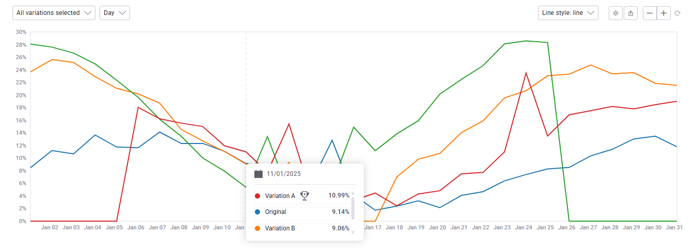

# Interactive Line Chart

Тестовое задание: интерактивная линейная диаграмма для визуализации статистики A/B-тестов.\
Демо: [GitHub Pages]('https://ibarakilol.github.io/kameleoon-test-task/)



## Tech стак

React.js, TypeScript, SCSS, MobX, для графика была выбрана библиотека D3.

## Реализованные функции

- Отображение всех "вариантов" на графике в процентных значениях.
- При наведении курсора отображается вертикальная линия и попап с данными.
- График автоматически адаптируется под видимые данные, а так же под расширение экрана.
- Доп. настройки и функции: выбор "вариантов", выбор диапазона (день/неделя), управление зумом, выбор стиля графика, переключение цветовой темы, экспорт графика в PNG.

## Запуск проекта

Инструкция по настройке и запуску проекта в локальной среде.

1. **Клонирование репозитория:**

```bash
git clone https://github.com/Ibarakilol/kameleoon-test-task.git
cd kameleoon-test-task
```

2. **Установка зависимостей и запуск:**

```bash
yarn && yarn dev
```

После запуска приложение автоматически откроется в браузере и будет доступно по адресу: http://localhost:5173.
